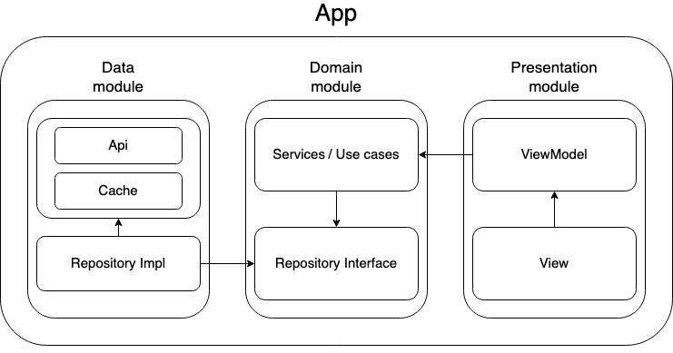

# Cocktail me app

Welcome to the Cocktail Me App! This app is designed to help you discover and create your favorite cocktails in a simple
and efficient way. This README provides an overview of the app, its architecture, and instructions on how to get it up
and running.

## Architecture

The Cocktail Me App is built following a clean architecture, which is organized into the following modules:

1. App: This module is responsible for injecting and setting up all the dependencies.
2. Data: This module manages data sources, such as APIs and databases as well as repository logic.
3. Domain: The domain module contains the core business logic and entities of the application.
4. Presentation: This is the user interface module, responsible for rendering the app's screens and handling user
   interactions.

<div style="text-align: center;">
    <p>Architecture Diagram</p>
    
</div>

## How to Run

Before you can run the Cocktail Me App, please follow these steps:

1. Open the app module
2. Firebase Setup: Make sure you have Firebase configured for the app module. If you haven't done this already, use the
   following command with the Firebase CLI:

```shell
firebase login

dart pub global activate flutterfire_cli

flutterfire configure
```
